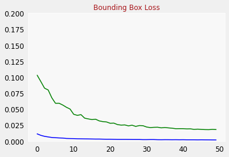

# Computer Vision Projects
Applying Object Localization and Object Detection techniques on various projects

# Birds Detector

**This project involves using Object detection and Object localization to create boxes around the birds using Intersection over union process**

**I have used [caltech_birds_2010](http://www.vision.caltech.edu/visipedia/CUB-200.html) dataset for creating a object detector, and have referred to concepts from Coursera for applying in this project**

**Libraries Used**:

1. Tensorflow
2. OpenCV
3. PIL
4. Tensorflow Datasets

**Outputs**

**For outputs do check out the jupyter notebook**
